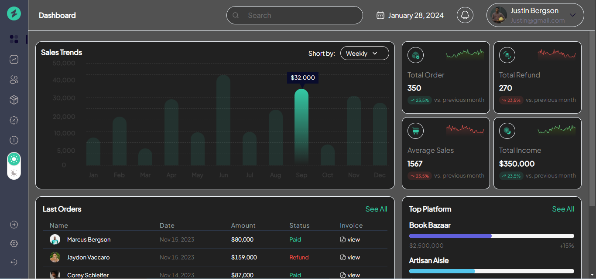
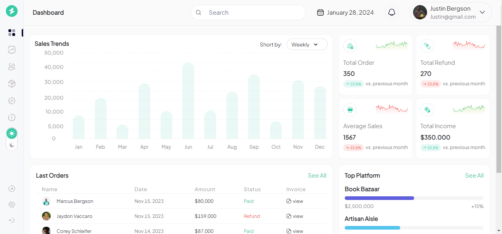
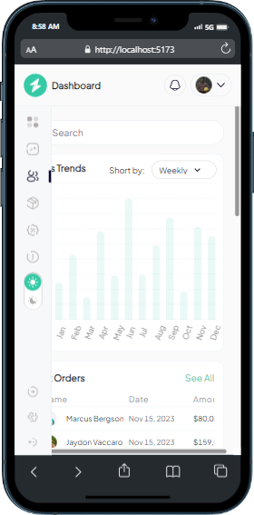
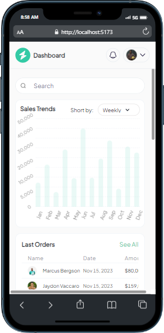
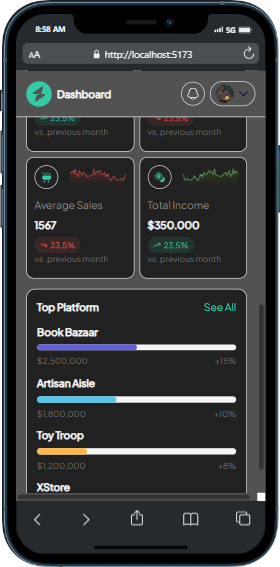

# Analytic_Dashboard

This project is a challenge hosted by Geegpay. it is fully responsive on a mobile phone

## Getting Started

Clone or download this repository and run with a local server of open `index.html` with your favorite browser

## Prequisite

- Your browser version must be recent for a better experience.

## Features

- Dashboard Page
- Side Panel
- Navbar

## Tech/framework used

- HTML
- CSS
- ReactJS
- TypeScript
- Vite
- ChakraUI

## Preview

[Preview Here](https://analytic-dashboard-three.vercel.app/)

## Contact

If you want to contact me you can reach me at
-wolabash@gmail.com -https://github.com/PrimeFord

## Addtional Info

- This is one of the series of my projects.
- This is not meant for production. It's for learning purpose only
